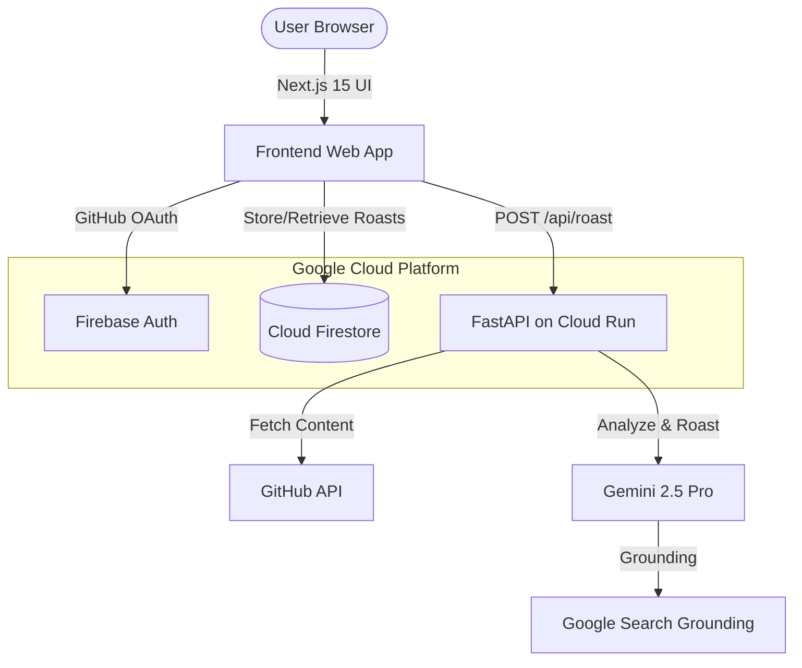

[](https://www.linkedin.com/posts/bingidineshkumar18_promptwars-buildwithai-googleantigravity-ugcPost-7450873876131024896-ggH4?utm_source=share&utm_medium=member_desktop&rcm=ACoAAFTRObMBqDe-RsBzglkKQbLnzvIV4pJ3ILQ)

# Roast-My-Stack 🔥
> **AI Code Roaster with Brutal Honest Feedback**
> Built for PromptWars Virtual | Google Antigravity + Google AI Services

---

## 🚀 What is RoastMyStack?

**RoastMyStack** is a web application where developers can paste a GitHub repo URL or a raw code snippet to receive two things:

1.  **A Brutal, Honest Roast:** Written in the voice of a senior engineer with zero patience — identifying bad patterns, lazy naming, security holes, architectural sins, and code smells.
2.  **A Structured Fix Plan:** Precise, actionable steps to fix every issue raised in the roast, ranked by severity.

Every roast is scored across 6 evaluation axes that mirror the PromptWars AI scoring criteria. It’s designed for developers who want honest feedback without the social cost of asking a colleague.

---

## 🔥 Features

-   **Three Intensity Levels:** Select from "Junior Review", "Senior Review", or "Staff Engineer Wrath".
-   **GitHub Integration:** Fetches repository content directly via GitHub API.
-   **Shareable Roasts:** Every roast session is saved to Firestore and generates a unique, shareable URL.
-   **Improvement Tracking:** Log in with GitHub to save your roast history and track your improvement over time.
-   **AI Grounding:** Fix suggestions are grounded against real-time Google Search results for current best practices.

---

## 🛠️ How We Built It (Tech Stack)

RoastMyStack leverages a cutting-edge stack with deep integration of Google Cloud and AI services:

### **Google AI Services**
-   **Gemini 2.5 Pro (Core Engine):** Used for code analysis, roast generation, fix plan creation, and severity scoring.
-   **Gemini Search Grounding:** Grounding fix suggestions against live Google Search results (e.g., OWASP guidelines).
-   **Vertex AI / AI Studio:** Accessing the long-context Gemini models.

### **Backend (API Layer)**
-   **FastAPI (Python 3.12):** A high-performance web framework for the API.
-   **Google Cloud Run:** Serverless hosting that scales with demand.
-   **Firebase Admin SDK:** Server-side interaction with Firestore and Auth.
-   **Google Artifact Registry:** Stores Docker images for deployment.

### **Frontend (UI Layer)**
-   **Next.js 15 (App Router):** Latest React framework for a fast, SEO-friendly interface.
-   **Tailwind CSS:** Modern utility-first styling for a sleek, responsive design.
-   **Firebase Auth (GitHub OAuth):** Secure social authentication.
-   **Cloud Firestore:** Real-time database for roast sessions and history.

---

## 📐 Architecture



---

## 🔄 How It Works — User Flow

1.  **Input:** User pastes a GitHub URL or raw code.
2.  **Selection:** Chooses roast intensity (Junior/Senior/Staff).
3.  **Processing:** 
    - Cloud Run fetches the repo content.
    - Code is sent to Gemini 2.5 Pro with a "Brutal Senior Engineer" persona instruction.
    - Gemini returns a structured JSON containing the roast text, issue list, fix plan, and scores.
4.  **Display:** Frontend renders an animated roast reveal and an interactive fix plan card.
5.  **Sharing:** A unique Firestore-backed URL is generated for sharing on social media.

---

## ⚙️ Setup & Installation

### Prerequisites
- Python 3.12+
- Node.js 18+
- Google Cloud Project with Gemini API enabled
- Firebase Project

### 1. Backend Setup
```bash
cd backend
python -m venv venv
source venv/bin/activate  # On Windows: venv\Scripts\activate
pip install -r requirements.txt
# Set up environment variables (GEMINI_API_KEY, FIREBASE_CREDENTIALS)
uvicorn main:app --reload
```

### 2. Frontend Setup
```bash
cd frontend
npm install
# Set up .env.local with Firebase config
npm run dev
```

---

## 📊 Evaluation Criteria Coverage

| Criterion | How We Cover It |
| :--- | :--- |
| **Code Quality** | Gemini scores and critiques patterns explicitly. |
| **Security** | AI identifies SQLi, secret exposure, and auth flaws. |
| **Efficiency** | Performance issues (N+1 queries, loops) are flagged. |
| **Testing** | Missing tests are called out in the fix plan. |
| **Accessibility** | Built with semantic HTML and ARIA best practices. |
| **Google Services** | Gemini, Firebase (Auth/Firestore), Cloud Run, Artifact Registry. |

---

## 💬 Reach Out

For questions about cloning this repo, how it works, or to see the story behind it, reach out directly on the LinkedIn post:
👉 [**LinkedIn Post Link**](https://www.linkedin.com/posts/bingidineshkumar18_promptwars-buildwithai-googleantigravity-ugcPost-7450873876131024896-ggH4?utm_source=share&utm_medium=member_desktop&rcm=ACoAAFTRObMBqDe-RsBzglkKQbLnzvIV4pJ3ILQ)

---
*Built with ❤️ using Google Antigravity & Google AI.*
